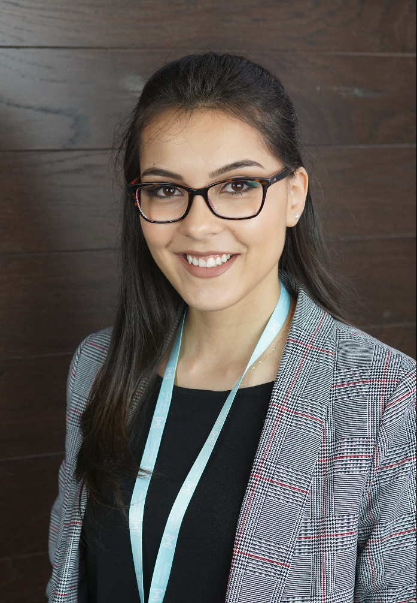

# Carolina Prates

## Hey there 👋, 
I'm Carolina Prates, I'm a Computer Science Student 👩‍🎓💻 who is passionate about Java and JavaScript technologies and its entire ecosystem. 

- 👩‍💻 I’m currently working on some projects here on Github.
- 📖 I’m currently learning Java, JavaScript, Node.JS.
- 💬 Ask me about: women in tech, English, cats, and dance.
- ⚡ Technologies: Java, Spring, JavaScript, Node.JS.

"Be the change you want to see in the world."
